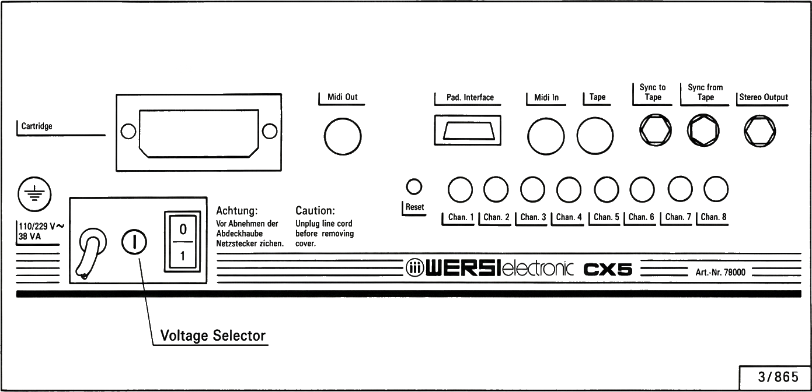
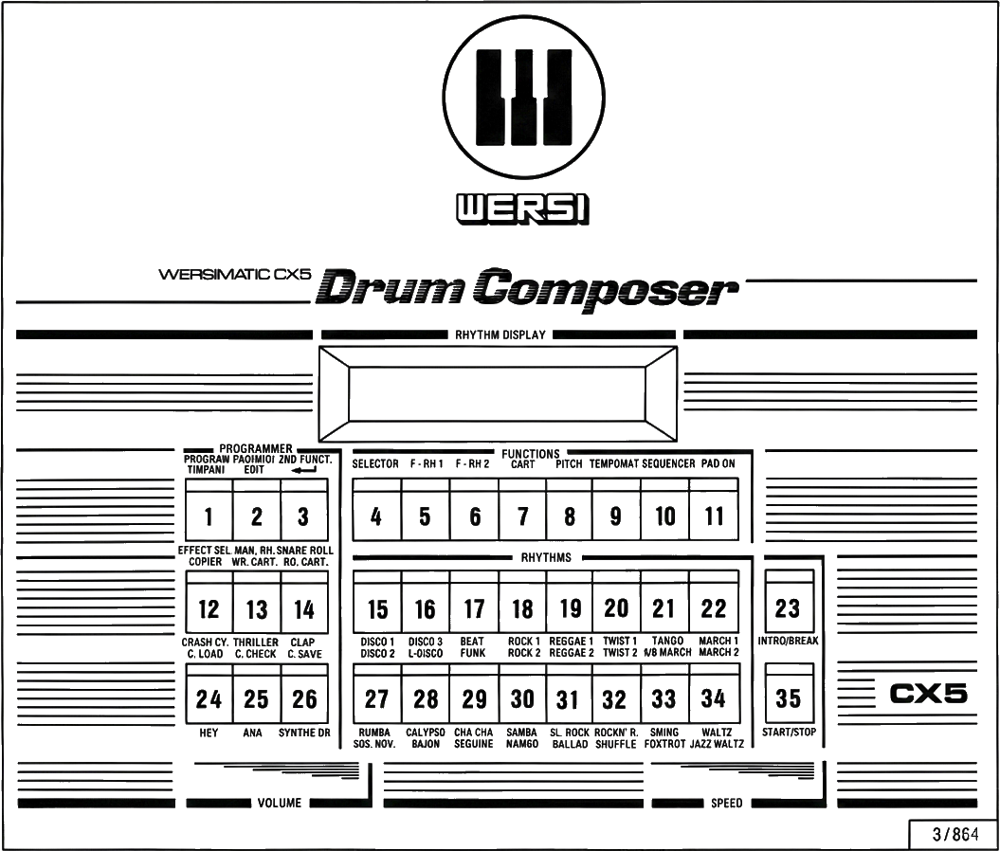
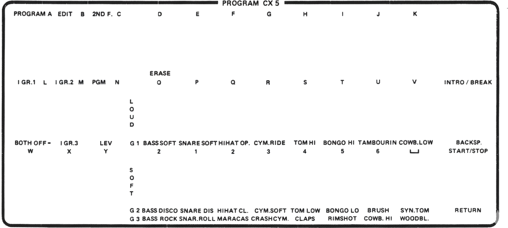
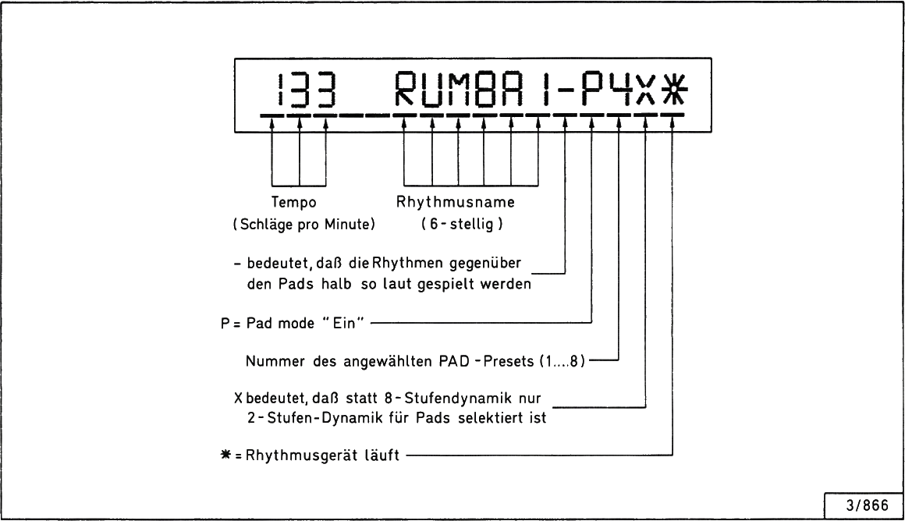

# WERSI Drum Composer CX 5 – User Manual

**Model:** Drum Composer CX 5  
**Manual No.:** BA 392  

---

## Preface

This user manual is designed to help you learn about the many capabilities and applications of the WERSI Drum Composer CX 5.

The numerous labels and inscriptions on the control panel may initially confuse you, but do not worry: all functions of your CX 5 are explained in detail.

The first part of the manual covers the functions and possibilities of the **basic configuration**, while the second part introduces the additional capabilities and applications of the **full configuration**.  
Even if you purchased the CX 5 in the full configuration, you should first familiarize yourself with the basic version.

As you know, the capabilities of a computer system are determined by its **software**; this also applies to the CX 5. Please note that software changes may result in deviations from the functions described here.

Now enjoy your WERSI Drum Composer CX 5!

---

## Capabilities of the Drum Composer WERSIMATIC CX 5

The following list describes the CX 5 in its **highest configuration level**.

### Rhythms and Storage

- **64 rhythms** (including 64 intros + 64 breaks) permanently programmed  
- **32 rhythms** (including 32 intros + 32 breaks) freely programmable in RAM  
- **32 rhythms** (including 32 intros + 32 breaks) stored on RAM cartridge  

→ **Total: 128 rhythms** immediately available.

Each of the 128 rhythms can be copied to any storage location in RAM or to the cartridge. This allows you to create different cartridges with various rhythm sets.

### Instruments and Sounds

| # | Instrument | Type |
|---|---|---|
| 1 | Bass drum, Disco | Digital |
| 2 | Bass drum, Soft | Digital |
| 3 | Snare drum, Soft | Digital |
| 4 | Snare drum, Disco | Digital |
| 5 | Hi-hat closed (stuck) | Digital |
| 6 | Hi-hat open | Digital |
| 7 | Conga high | Digital |
| 8 | Conga low | Digital |
| 9 | Tom tom high | Digital |
| 10 | Tom tom low | Digital |
| 11 | Cymbal ride | Digital |
| 12 | Cymbal soft | Digital |
| 13 | Crash cymbal | Digital |
| 14 | Rimshot | Digital |
| 15 | Handclap | Digital |
| 16 | Trill | Digital |
| 17 | Woodblock | Digital |
| 18 | Bass drum, Rock | Digital |
| 19 | Cowbell high | Digital |
| 20 | Cowbell low | Digital |
| 21 | Maracas | Digital |
| 22 | Brush | Digital |
| 23 | Tambourine | Digital |
| 24 | "Hey" | Digital |
| 25 | "Aha" | Digital |
| 26 | Timpani | Digital |
| 27 | Synthedrum | Analog |

### Key Features

- **Manual Rhythm:** 16 of the 27 instruments can be triggered manually (with the rhythm stopped)  
- **Sequencer:** up to 16 sequences, maximum total length 432 bars  
- **Tempomat (Cruise control):** fixed “ideal” tempo per rhythm, recallable for each programmable rhythm  
- **Pitch control:** overall tuning of the digital instruments via the “Pitch” function  
- **16-character alphanumeric display** for:
  - Tempo (beats per minute)  
  - Rhythm names  
  - User guidance and programming messages  
- **Programmable rhythm names** (up to 6 characters) for user rhythms  
- **Timpani mode:** timpani playable over one octave from the control panel  
- **Drum Pads:**
  - Up to 8 pads can be connected via the pad connection kit  
  - Each pad can be assigned any of the pad-capable instruments  
  - 8-step velocity dynamics  
  - In pad mode, up to **63 instruments** available (rhythm + special toms/timpani tunings)  
  - Up to **8 pad presets** (instrument + pitch setups) can be stored  
  - Pads are playable during a running rhythm  
- **Audio / Storage / Sync / MIDI:**
  - Cassette interface (save / load rhythm data)  
  - 8-channel studio output  
  - Cartridge (RAM) interface  
  - Sync to Tape / Sync from Tape  
  - MIDI interface (clock, notes, real-time, program change for rhythm selection)

---



## Preparations

Before you can get started, you must make the necessary connections and observe the following important safety measures.

### Power Connection

- **Check mains voltage:**  
  The specification on the voltage selector next to the mains input must match your household mains voltage.

- **Connect to mains:**  
  Insert the power cable into a properly installed Schuko socket.

- **Protection:**  
  The power transformer is short-circuit protected by a **thermal fuse** and therefore requires no primary mains fuse.

Observe VDE regulations.  
Always unplug the power cable before opening the device.

**Note for cold weather:**  
Devices coming from cold environments fog up in warm rooms. This condensation is a normal physical process. Please wait until the device has fully dried before switching it on, as leakage currents could cause damage.

→ First acclimatize, then play.

### Audio Connection

The CX 5 has **two** types of audio connections.

#### Stereo Output (Sum)

Via the stereo jack socket **“Stereo Output”**:

- Two-channel summed signal  
- Connect:
  - Keyboard / organ amp  
  - Mixer stereo input  
  - Active loudspeakers  
  - High-impedance stereo headphones (> 800 Ω)

#### 8-Channel Studio Outputs

For use with a mixing console, **8 separate channels** are available via RCA connectors.

The 27 instruments of the CX 5 are distributed across the 8 channels:

| Channel | Instruments                                              |
|---------|----------------------------------------------------------|
| Chan. 1 | Bass drums                                              |
| Chan. 2 | Snares                                                  |
| Chan. 3 | Hi-hats                                                 |
| Chan. 4 | Tom-toms, Timpani                                      |
| Chan. 5 | Cymbals                                                 |
| Chan. 6 | Bongos, Synthedrum                                      |
| Chan. 7 | Tambourine, Brush, Trill, Handclap, “Hey,” “Aha”        |
| Chan. 8 | Cowbell, Crash cymbal                                   |

No audio is available at the other connectors – they carry control signals (pads, sync, MIDI, etc.). These are explained in their respective chapters.

---

## Basic Configuration



### Switching On

Switch on the device using the **power switch** located on the back of the unit.

- All LEDs in the control panel buttons briefly blink as a **start check**.  
- The display shows: `DRUMCOMPOSER CX 5`.  
  (The basic hardware version may not have a display.)

**Note:** For reference, the control panel buttons are numbered from **top left = 1** to **bottom right = 35**.

### Selecting and Starting a Rhythm

1. Press any rhythm selection button **15**–**22** or **27**–**34**.  
   - The start check ends.  
   - The selected rhythm button LED and button **6 “F-RH 1”** (Fixed Rhythm Group 1) remain lit.  
   - The LED of **“START/STOP” (35)** blinks.

2. The display shows the rhythm name.

3. Start the rhythm by pressing **“START/STOP” (35)**.  
   - A play symbol (in some versions “*” or “▶”) lights up on the right side of the display.  
   - The left side shows the tempo in **beats per minute (bpm)**.  
   - Range: approx. **20–233 bpm** depending on software version.

4. Use the **“Speed”** slider to change tempo and the **“Volume”** slider to set overall volume.

The **“START/STOP”** button also blinks at the beginning of each bar (down-beat indicator).

### Changing Rhythms

To change the rhythm while stopped or running:

- Press another rhythm selection button **15**–**22** or **27**–**34**.  
- The new rhythm name appears immediately in the display.

### Selector

The **“Selector”** button (4) switches between the two fixed rhythm groups:

- Group 1: **F-RH 1** (button **6** inactive as selector)  
- Group 2: **F-RH 2** (button **6** active)

Each physical rhythm button then has **two rhythms**:

- Upper inscription: Group 1
- Lower inscription (or alternate version): Group 2

The names of the second rhythms are not printed on the buttons but are displayed on the alphanumeric display.

### Reset Function

Pressing the **red Reset switch on the back**:

- Immediately stops all functions  
- Returns the device to the defined **initial state** (start check)

Use this function whenever you have made an operating error and are unsure how to continue.

---

### Tempomat (Cruise Control)

The CX 5 provides a stored “ideal tempo” for each rhythm.

- Activate **“Tempomat” (9)** → LED lights:  
  - Every selected rhythm plays at its stored **standard tempo**.  
  - The **“Speed”** slider becomes inactive.

- Deactivate **Tempomat** (press again) → LED off:  
  - Tempo is again adjustable via **“Speed”**.

For user-programmed rhythms, you can define your own standard tempo (see section **Programming Standard Tempo**).

---

### Start/Stop / Intro/Break

Each programmed rhythm generally consists of **two different bars** that alternate.

- The **Down-Beat Indicator** (LED of “START/STOP”) marks the **first beat of each bar**.
- **“Start/Stop”** always starts the rhythm on the **“one”** of the first bar.

For each rhythm there is:

- An **Intro** (introduction)  
- A **Break** (solo / fill)

Operation:

- Tap **“Intro/Break” (23)** briefly while stopped:  
  - The intro plays for one bar, then the normal rhythm follows.

- While rhythm is running:
  - **Short tap (< 0.1 s):** triggers a one-bar break starting at the next bar.  
  - **Long press:** break starts immediately and continues as long as the button is held.

---

### Pitch

You can change the overall tuning (pitch) of all digital instruments.

1. Start the desired rhythm.  
2. Press **“Pitch” (8)** – LED lights; **“Speed”** slider now works as **pitch** control.  
3. Adjust pitch with the **“Speed”** slider.  
4. Press **“Pitch” (8)** again – LED off; **“Speed”** returns to tempo control.

The selected tuning applies globally to all rhythms until changed again.

- To return to normal tuning, repeat the procedure and set the “Speed” slider to its **center** position.  
- After power-off, the CX 5 automatically returns to **normal tuning**.

---

### Snare Roll

The **“Snare Roll”** function (button **14**) triggers a snare drum roll, even while a rhythm is running.

---

### Sound Effects

In full configuration, the CX 5 offers **6 sound effects**, organized in two groups:

**Group 1:**

- Crash cymbal  
- Thriller  
- Clap  

**Group 2:**

- “Hey”  
- “Aha”  
- Synthe Drum  

Use **“Effect Sel.” (12)** to switch between the two groups.

(Internally this corresponds to two effect banks; the same buttons **24**–**26** trigger either *group 1* or *group 2*.)

---

### Manual Rhythm (Man. Rh.)

The **Manual Rhythm** mode allows you to trigger up to 16 instruments directly “by hand” when the rhythm engine is stopped.

- Press **“Man. Rh.” (13)** – LED lights:  
  - Rhythm buttons **15–22, 27–34** become **instrument triggers** (play the assigned instruments directly).

- Press **“Man. Rh.”** again – LED off:  
  - Manual mode is off; the previously selected rhythm is again ready to run.

You can also start the previously selected rhythm directly with **“START/STOP”** even if Manual Rhythm is still active – the rhythm will take over.

---

## Full Configuration


### Timpani Mode

You can play **13 timpani** tuned in semitone steps from the panel:

1. Press **“2nd Function” (3)** – LED blinks.  
2. Press **“Timpani” (1)**.  

The LEDs of buttons **15**–**31** light up and the display shows **“Timpani Mode on”**.

- Buttons **15**–**31** now play timpani notes over an octave.  
- Press **“2nd Function”** again to exit Timpani mode.

---

### Programming Rhythms

You can program up to **32 own rhythms** into the free memory locations and later:

- Recall  
- Edit  
- Delete  
- Save to cassette or cartridge

(You can save the 32 rhythms to cassette or cartridge and read them back in to create your own rhythm archive; see [Cassette Save](#cassette-save) and [Write Cartridge (Wr. Cart.)](#write-cartridge-wr-cart)).

For programming, place the included **control panel mask** on the panel; it shows the alternate programming labels for the buttons.



#### Selecting Storage Location

- Make sure **F-RH 1**, **F-RH 2**, and **Cart.** LEDs are **off** (you must be in the free RAM group).  
- Press any button **15–22 or 27–34** → 16 basic locations.  
- Use **“Selector”** to access a second location per button (total: **32** locations).

If a rhythm is already stored there, its name appears in the display.

- Press **“Program” (1)** twice (LED on).  
  - The display shows `BEATS TIMES`.

#### Entering Time Signature

1. Press **“Erase” (4)** – LED lights.  
   - Buttons **15**–**22** (upper row) now have numeric values **1**–**8**.

2. Define **beats per bar** and **subdivision (steps per beat)**:

   - **3/4 time:**  
     - Press **17** → value *3* (beats)  
     - Press **18** → value *4* (steps)

   - **4/4 time:**  
     - Press **18** twice → (*4* beats) × (*4* steps) = *16* sixteenth notes per bar  

   - **6/8 time:**  
     - Press **20** → value *6* (beats)  
     - Press **16** → value *2* (subdivision)

   - **5/4 time:**  
     - Press **19** → value *5* (beats)  
     - Subdivision = triplets (*3* steps) as per mask / documentation (e.g. button labeled **3** on *control panel mask*)

> **Note:** To enter a 4/4 time signature, press **18** twice (enter two 4s):
> the **first 4** sets the number of beats per bar, the **second 4** sets the subdivision (steps per beat).
>
> Applied to 4/4, each quarter note is divided into 4 sixteenth notes — **4 × 4 = 16** sixteenth notes per bar.

Conceptually:

- **Beats × Steps = total grid steps per bar**

Applied to our example of **4/4** time, each quarter note is divided into four sixteenth notes — **4 × 4 = 16** sixteenth notes per bar.

### Examples

- **4/4 — Entering 4/4**
   - Press **18** twice (enter two 4s): the **first 4** sets beats per bar, the **second 4** sets subdivision (steps per beat).
   - Result: **4 × 4 = 16** sixteenth notes per bar.
   

- **6/8 — Entering 6/8**
   - Press **20** → value **6** (beats).
   - Press **16** → value **2** (subdivision / steps per beat).
   - Result: **6 × 2 = 12** sixteenth notes per bar.

- **5/4 — Entering 5/4 (Take Five feel)**
   - Press **19** → value **5** (beats).
   - Use subdivision **3** (triplet steps) to get the swing feel (press the panel mask button labeled **3**).
   - Result: **5 × 3 = 15** triplet steps per bar.

When finished, the display shows the new time signature and **“Erase”** (4) is no longer lit.

3. Press **“Pgm/Lev” (14)** – LED on → **Program** mode active.  
4. Press **“START/STOP”** to start the metronome (uses Rimshot).  
   - Display counts:
     - Bars  
     - Beats  
     - Steps (max. 16 per beat)

#### Playing in Instruments

The instruments are divided into **three groups**:

- Group 1: **“I. Gr. 1” (12)** LED on  
- Group 2: **“I. Gr. 2” (13)** LED on (label may vary by mask)  
- Group 3: both **I. Gr. 1** and **I. Gr. 2** off

Buttons **15, 22, 27, 34** (and their rows) become instrument selection buttons.  
The **upper row** is louder; the **lower row** is the same instruments at lower volume.

Workflow:

1. Select **instrument group** (I. Gr. 1 / I. Gr. 2 / both off).  
2. Start Program mode and the metronome.  
3. Play the rhythm by tapping instrument buttons; events are recorded on the bar grid.  
4. LEDs in the instrument buttons indicate which instruments are active in the pattern.

Constraints:

- Instruments that share the **same button** across the three groups (listed vertically on the mask) **cannot be placed at exactly the same step** in the bar.

Correcting mistakes:

- Press **“Erase” (4)**.  
- Then press the instrument button you want to clear (with correct group selected).

When finished, delete the metronome:

- Press **“Erase”** and the **“Rimshot”** instrument (part of group 3).

#### Programming Volume (Levels)

After placing instruments, you can program volume levels per instrument:

1. Turn **“Pgm/Lev” (14)** **off**; the display shows `LEVELS`.  
   (This activates **Level Edit** mode.)

2. Press **“I. Gr. 1” (12)** to edit levels for group 1 instruments:  
   - Use **upper** instrument button to increase level  
   - Use **lower** button (same position) to decrease level  
   - Levels are from **1**–**7** (shown in display)  
   - The last selected level is stored.

3. Press **“I. Gr. 2”** to program group 2 levels.  
4. With both group LEDs off, you edit levels for group 3.

5. Press **“Program” (1)** – LED off: exit programming mode.

#### Entering Intro/Break

You can program an **Intro** and a **Break** pattern for each user rhythm.

1. Call up the rhythm.  
2. Press **“Program” (1)** twice.  
3. Press **“Pgm/Lev” (14)** and **“Intro/Break” (23)** – both LEDs on.  
4. Press **“START/STOP”** – the program runs:

   - **First bar** = Intro  
   - **Second bar** = Break

5. Program instruments as before, then press **“Program” (1)** again – LED off to save.

#### Programming Standard Tempo (for Tempomat)

1. Call up the user rhythm.  
2. Start the rhythm.  
3. Set the desired tempo with the **“Speed”** slider.  
4. Press **“Program” (1)** once.

The selected tempo is saved as that rhythm’s **standard tempo** and can be recalled by pressing **“Tempomat”**.

#### Pitch

Same as described in **Basic Configuration → Pitch**.  
Pitch programming does not change the stored standard tempo.

#### Editing Rhythm Names

1. Select the user rhythm.  
2. Press **“2nd Function” (3)** – LED blinks.  
3. Press **“Edit” (2)** – LED on.

The display shows: `EDIT`.

The keypad now acts like a typewriter. According to the panel mask:

- Buttons **1**–**22**: letters *A*–*Z* (distributed across buttons)  
- Buttons **28**–**33**: numbers *1*–*6*  
- Button **34**: space  
- Button **23**: delete/backspace

You can assign a **6-character name**. The new name is shown in the display.

- Press **“START/STOP” (35)** to exit Edit mode and save the name.

---

### Programming Sequences

You can compile up to **16 different sequences** from the programmable rhythms:

- Maximum total length: **432 bars**  
- Stored in the memory positions of buttons **15–22 and 27–34**

Steps:

1. Select the memory location where the sequence will be stored (15–22 or 27–34, with / without Selector).  
2. Press **“Sequencer” (10)** – LED on.  
3. Press **“Program” (1)** twice – LED on; display shows `Bar 0`.  

Now:

4. Call up the first rhythm and start it (START/STOP 35).  
5. Press **“Sequencer”**:
   - Once → 1 bar of this rhythm added to sequence  
   - Twice → 2 bars, etc.  
   (Display counts bars added.)

6. Optionally:
   - Activate **“Intro/Break”** to insert fills.  
   - To insert empty bars (pauses):  
     - Press **“STOP”** and then **“Sequencer”** (once = 1 bar pause).

7. Continue selecting rhythms and pressing **“Sequencer”** to build the full sequence.

To clear the current sequence while programming:

- Press the button documented as **“clear sequence”** (often button **12** in panel legend); display returns to `Bar 0`.

**Ending sequence recording:**

- **Endless loop:**  
  - While the rhythm is running, press **“Program”**.  
  - Later, when this sequence is selected, it plays in a loop until stopped.

- **Play-once mode:**  
  - Press **“STOP”** and then **“Program”**.  
  - Later, the sequence plays through once and stops.

**Selecting a sequence:**

1. Select the sequence memory location (15–22 or 27–34).  
2. Press **“Sequencer” (10)**.  
3. Press **“START/STOP” (35)** to play.

---

### Rhythms in the Cartridge

On the back of the CX 5 there is a cartridge slot for a **WERSI RAM cartridge**.

You can:

- Save all user rhythms, intros/breaks, tempos, pad presets, and sequences to a cartridge  
- Load them back later into RAM  
- Play rhythms and sequences **directly** from the cartridge

#### Write Cartridge (Wr. Cart.)

The **“Write Cartridge”** command duplicates the following from CX 5 RAM to the cartridge (overwriting previous cartridge contents):

- 32 user rhythms + 32 intros + 32 breaks  
- 32 tempo settings (standard tempos)  
- 16 sequences  
- 8 pad presets including 8 pad tunings

Procedure:

1. Press **“2nd Funct.” (3)**.  
2. Press **“Wr. Cart.” (13)**.

All programmable content is now written to the cartridge.

#### Read Cartridge (Rd. Cart.)

To load a cartridge into CX 5 RAM:

1. Press **“2nd Funct.” (3)**.  
2. Press **“Rd. Cart.” (14)**.

The contents of the cartridge now occupy the free programmable memory.

#### Playing from Cartridge (Cart.)

a) **Rhythms from cartridge:**

1. Press **“Cart” (6)**.  
2. Use the rhythm selection buttons (and **Selector**, if needed) to choose a cartridge rhythm.  
3. Press **“Start/Stop” (35)** to play.

b) **Sequences from cartridge:**

1. Press **“Cart” (6)**.  
2. Press **“Sequencer” (10)**.  
3. Select the sequence memory location.  
4. Press **“Start/Stop” (35)** to play.

---

### Copying Rhythms

You can copy rhythms between memory locations.

#### Within Programmable Rhythms

1. Call up the **source** user rhythm (**15**–**22** or **27**–**34**, with/without Selector).  
2. Press **“Program” (1)** once.  
   - Display shows `Copy/Prg Rhythm`.  
3. Select the **destination** memory location (again via **15**–**22**, **27**–**34**, with/without Selector).

The rhythm is now present in **both** locations. You can edit the copy independently.

#### Using the “Copier” Function

You can copy **fixed factory rhythms** into free memory, or transfer between RAM and cartridge:

1. Call up the **source** rhythm:
   - From **F-RH 1** or **F-RH 2**, or  
   - From cartridge (Cart.)  
2. Press **“2nd Funct.” (3)**.  
3. Press **“Copier”** – display shows `Copy Rhythms`.  
4. Select the **destination** memory location in the free group (or on the cartridge).

The previous content of the destination is deleted; the new rhythm and its name are copied there.

**Note:**  
Whenever the CX 5 performs a program function, the related key LED usually blinks. Pressing that key again cancels the function and returns the device to normal mode.

---

## Drum Pads CX 5



> **Display symbols (Pad mode)**  
> Tempo (bpm) – left  
> Rhythm name (6 characters) – center  
> “P” – Pad mode active  
> Number 1–8 – selected pad preset  
> “–” – rhythms at half the pad volume  
> “X” – 2-step dynamics instead of 8-step  
> “*” / Play icon – rhythm running

Conventional percussion instruments are increasingly replaced by **drum pads**. They are compact, light, and very flexible.

### Accessories Needed

- CX 5 in **full configuration**  
- **Pad Connection Kit** (interface for up to 8 pads)  
- One **bass pad** and up to 7 **universal pads**  
- One **mono jack-to-jack cable** per pad  
- Stands for pads, and a **bass drum pedal** for the bass pad if desired  
- Optional **Hi-hat switch** and **Start/Stop footswitch**

**Connecting (always with CX 5 switched off):**

1. Connect the **Pad Connection Kit** to the **Pad Interface** on the back of the CX 5.  
2. Connect pads to the connection kit with jack–jack cables.  
3. Optional: connect **Hi-hat switch** and **Start/Stop footswitch** to the designated inputs.

The LEDs on the connection kit light when pads are triggered.  
You can adjust each pad’s sensitivity using the **“Sens.”** control.

### Activating Pad Mode

1. Switch on the CX 5.  
2. Press any rhythm button **15–22 or 27–34** (start check ends).  
3. Press **“Pad on” (11)** – LED lights.

The display shows a **“P”** at the right, followed by a **“1”**:

- “P” = Pad mode on  
- “1” = Pad preset 1 (factory default) active

If the “1” does not appear:

- Press **“Pad on”** again and then button **15** to select preset 1.

In pad mode, the LEDs of buttons **27**–**34** operate as a **VU meter** for the currently played pad instrument.

**Important:**  
Immediately after first activation of pad mode, pad tunings are random.  
Program sensible tunings using **6.8 Programming Pitch Preset**.

> **Pad layout (example, original text)**  
> Pad 1 – BassDrum  
> Pad 2 – Hi-hat  
> Pad 3 – SnareDrum  
> Pad 4 – Bongo low  
> Pad 5 – Tom high  
> Pad 6 – Tom low  
> Pad 7 – CrashCymbal  
> Pad 8 – SyntheDrum

### Pads During Running Rhythm

You can play pads along with a running rhythm:

1. Select **Pad preset 1**.  
2. Select a rhythm and start the CX 5.

To make the pads stand out more clearly against the rhythm:

- Press **“Program” (1)**.  
- A **minus sign “–”** appears in front of “P” in the display, meaning the rhythm is played **24 dB quieter** than the pads.

### Special Pad Mode

In normal pad mode, when **two pads are mounted on a common stand**, very fast successive tom hits may occasionally cancel each other.

This does **not** occur in **Special Pad Mode**:

- While in pad mode, press **“2nd Funct.” (3)** to toggle **Special Pad Mode**.  
- In Special Pad Mode, the CX 5 is a **pure pad machine**; playing pads along with an internal rhythm is disabled in favor of highest possible response speed.  
- Pad presets are selected directly by rhythm buttons **1**–**8**.

Exit Special Pad Mode by pressing **“Pad on”**.

### Deactivating Pad Mode

- Press **“Pad on” (11)** – LED blinks.  
- Press **“Pad on”** again – LED off (pad mode off).

### Assigning Instruments to Pad Presets

Besides the factory preset 1, the CX 5 provides **7 further presets**, each capable of storing **8 instruments + pitch** (total of 63 assignable instruments across all presets).

Preset 1 can also be edited, but after power-off or Reset, it returns to the factory assignment.

Procedure:

1. Press **“Pad/Midi” (2)** – LED blinks → Pad/MIDI Program Mode.  
2. Press **“Effect Sel.” (12)** → Pad Assignment Mode.  
   - Display shows: `Which Preset ???` (or similar).  
3. Buttons **15**–**22** now select presets *1*–*8*.  
   - Example: Press **16** to select preset *2*.  
4. The display now shows: `Pad 1` and the currently assigned instrument.

Use **“START/STOP” (35)** and **“Intro/Break” (23)** to scroll through all **63 pad-capable instruments**:

- Holding either button: auto-repeat scrolls forward/backwards.  
- Short taps: step one instrument at a time.

5. Choose the desired instrument for **Pad 1** (leave it in the display).  
6. Use buttons **15**–**22** (now pad selectors 1–8) to move through pads and assign instruments to each.  
7. When all pads are assigned, press **“Pad/Midi” (2)** again – LED off to exit.

**Instrument groups (mutual exclusion within a preset)**  
Within a single pad preset, the following groups cannot sound simultaneously at the same time position (only one from each group can be active):

1. Bass Drum Soft – Bass Drum Disco – Bass Drum Rock  
2. Snare Soft – Snare Rock  
3. Hi-hat open – Hi-hat closed – Maracas  
4. Tom high – Tom low – Timpani  
5. Cymbal ride – Cymbal soft  
6. Bongo high – Bongo low – Rimshot  
7. “Hey” – “Aha” – Tambourine – Trill – Handclaps  
8. Cowbell low – Cowbell high – Woodblock – Crash Cymbal

### Selecting Pad Preset

1. Press **“Pad on” (11)**.  
   - Display shows the current preset number next to *“P”*.  

2. To change presets:  
   - Press **“Pad on”** again – LED blinks.  
   - Press desired preset number **1**–**8** via buttons **15**–**22**.  
   - Selected number appears next to *“P”*.

### Programming Pitch Preset

For the currently selected pad preset, you can store its own **pitch**:

1. Press **“Pitch” (8)** – LED on.  
2. Adjust tuning with the **“Speed”** slider.  
3. Press **“Pad/Midi” (2)** – the **“Pitch”** LED goes out.

The pitch now belongs to that **pad preset** and is recalled with it.

**Caution:**  
Use the pitch function only for programming. When left active, it may cause audible artifacts (e.g., on hi-hat and cymbals).

---

## Data Transfer via Cassette Recorder

You can back up all user rhythms, intros, breaks, and sequences from the free group to a **standard cassette** and later reload them.

**Note:** These are **digital data**, not audio. You cannot listen to the rhythms directly from the cassette.

Connect the cassette recorder to the **5-pin “Tape” DIN socket** on the rear panel using a standard tape cable.

### Cassette Save

Saves the entire free group to cassette.

1. Connect the recorder as described.  
2. Prepare it for recording, but **do not start yet**.  
3. On the CX 5, press **“2nd Funct.” (3)** – LED blinks.  
4. Press **“C. Save” (26)**.  
5. Set the cassette recorder’s **record level to 100%** (for stereo recorders, only one channel is used).  
6. Start the recorder in **record** mode.  
7. Press **“2nd Funct.”** and **“C. Save”** again at the CX 5 to start transfer.

After transfer, the CX 5 returns to normal mode (see display).  
Stop the recorder.

**Tips:**

- Use high-quality tape; data errors are often due to poor tape quality.  
- Record **each data block twice** in succession for safety.  
- Perform **Cassette Check** after each transfer.

### Cassette Check

Checks that the cassette recording matches the CX 5 memory.

1. Rewind the cassette to the beginning of the data block.  
2. Press **“2nd Funct.” (3)** – LED blinks.  
3. Press **“C. Check” (25)**.  
4. Start the cassette recorder (play).

The CX 5 compares incoming data with its internal memory:

- If errors occur, an error message **“2” or “8”** appears in the display.  
  - Main causes: incorrect record level or tape errors.  
  - Remedy: repeat data transfer; if necessary, use a new cassette.

To exit cassette check:

- Press **“2nd Funct.” (3)**.

### Cassette Load

Loads previously saved data from cassette into the free group.

1. Press **“2nd Funct.” (3)**.  
2. Press **“C. Load” (24)**.  
3. Start the cassette recorder in **play** mode.  

Display shows: `Tape RX` (receiving tape data).

After successful transfer, the display shows: `Rec Stop E 00`  
(“00” = no errors detected).

Press **“2nd Funct.”** to return to normal mode.

**Summary:**  
The CX 5 offers two archive media for your custom rhythms and setups:

- **Cassette**  
- **RAM Cartridge**

---

## Sync to Tape / Sync from Tape

When using the 8-channel outputs of the CX 5 in professional **multi-track recordings**, you would normally occupy 8 tape tracks with drums.

Using **Sync to Tape / Sync from Tape**, you can instead:

- Record only a **tempo control signal** on one tape track.  
- Use the other tracks for other instruments.  
- Later, have the CX 5 play in **perfect sync** with the recorded material.

### Sync to Tape

Transfer the control (tempo) signal from CX 5 to a track of the multi-track recorder.

1. Connect CX 5 **“Sync to Tape”** output to one track input of the multi-track machine.  
2. Switch on both devices; arm the tape track for **record**.  
3. On CX 5:
   - Select rhythm or sequence and set desired tempo.  
   - Press **“Pad/Midi” (2)** – LED blinks.  
   - Press **“2nd Funct.” (3)** repeatedly until display shows `TX SYNC TO TAPE`.  
   - Press **“Pad/Midi” (2)** again – LED off; display shows `MSYST` (or similar).  
   - Set tempo exactly with the **“Speed”** slider – display shows e.g. `108 ST`  
     (108 = bpm, ST = Sync to Tape).

4. Start the tape recorder (recording).  
5. Start the CX 5 with **“START/STOP” (35)**.

The CX 5 now sends synchronization pulses to the multi-track tape.  
You may change the tempo during transfer; the variations are captured on tape and will later control the CX 5 accordingly.

When finished:

- Press **“START/STOP” (35)** to stop CX 5.  
- Stop the tape machine.

The sync signal is now stored on the tape.

### Sync from Tape

Use the previously recorded sync track to control the CX 5.

1. Rewind the tape to the start of the sync recording.  
2. Connect tape machine sync-track output to **“Sync from Tape”** input on CX 5.  
3. On CX 5:
   - Press **“Pad/Midi” (2)** once.  
   - Press **“2nd Funct.” (3)** repeatedly until display shows `RX SYN FROM TAPE`.  
   - Press **“Pad/Midi” (2)** once more.  
   - Display shows `TSY` (Tape Sync).

4. Start the tape machine in **play** (not record).

The sync signal from tape now automatically starts and controls the CX 5 in exact tempo and position.

**Checking Software Version (full configuration):**

1. Press and hold any rhythm selection button **15**–**21**.  
2. Briefly press the **Reset** switch.  
3. The display shows the **3-digit software version and release date**.  
4. Release the rhythm button – CX 5 returns to start check state.

---

## M.I.D.I.

**M.I.D.I.** = Musical Instrument Digital Interface

MIDI is a standardized digital interface for exchanging musical performance data between:

- Digital keyboards  
- Rhythm machines  
- Computers  
- Other MIDI devices

On the CX 5:

- **MIDI In** – 5-pin DIN  
- **MIDI Out** – 5-pin DIN  

Use standard MIDI/audio DIN cables, max. length approx. 15 m.

### Synchronizing Rhythm Machines

You can connect two CX 5 units, or the CX 5 and another MIDI-compatible drum machine, using the **MIDI clock**.

Example connection (CX 5 as both devices):

```text
Device A (CX 5)           Device B (CX 5)
---------                 ----------------
MIDI OUT   ───────────→   MIDI IN
(Clock Sender)           (Clock Receiver)
```

#### Device A – CX 5 as MIDI Clock Sender

1. Press **“Pad/Midi”** once – LED blinks.  
2. Press **“2nd Function”** repeatedly until `TRANSM SYNC MIDI` appears.  
3. Press **“Pad/Midi”** again – LED off.

Display indicates **“SM”** (Sync MIDI) near the tempo.

#### Device B – CX 5 as MIDI Clock Receiver

1. Press **“Pad/Midi”** once – LED blinks.  
2. Press **“2nd Function”** repeatedly until `REC SYNC MIDI` appears.  
3. Press **“Pad/Midi”** again – LED off.

Display shows **“MSY”** (Midi Sync).  
The **Speed** slider is disabled; device B now follows the MIDI clock from device A.

---

### Coupling CX 5 and Computer

Typical setup:

- Computer (e.g., Commodore 64 / SX-64)  
- WERSI Multi-Track 16 MIDI Sequencer (Art. No. 202016)  
- WERSI MIDI Interface (Art. No. 201143)  
- Floppy drive and monitor as required

#### Synchronization

In this mode, the **computer controls the CX 5 tempo** via MIDI clock, keeping rhythms or sequences synchronized with the multi-track arrangement.

#### Computer Synchronizes CX 5

1. Connect computer **MIDI Out** → CX 5 **MIDI In**.  
2. Enable **MIDI Clock** on the computer / sequencer (e.g., press “M” in WERSI Multi-Track 16).  
3. Activate CX 5 as **MIDI Clock Receiver** (see 9.1.3).

Now the computer controls CX 5’s tempo and Start/Stop.

---

### Computer Controls CX 5 and Receives Instruments

In this mode, the computer:

- Synchronizes the CX 5, and  
- Receives all **instrument MIDI events** (note numbers + velocities) from CX 5 rhythms or pads into the sequencer.

Connections:

1. Computer **MIDI Out** → CX 5 **MIDI In**.  
2. Computer **MIDI In** ← CX 5 **MIDI Out**.

Activation:

1. Switch computer to **MIDI Clock**.  
2. On CX 5:
   - Press **“Pad/Midi”** once – LED blinks.  
   - Press **“2nd Function”** three times until `SM + TR Instr. MIDI` appears.  
   - Press **“Pad/Midi”** once – LED off.

Display shows **“MSYT”** (MIDI Sync + Transmit).

Use case:

1. Call up desired rhythm or sequence on CX 5.  
2. Set desired sequence length in Multi-Track.  
3. Arm one track for recording.  
4. Start the computer (e.g., press **Return**).  

The CX 5 starts and sends all percussion MIDI events to the sequencer.

---

### Recording Percussion into Multi-Track via Pads

You can record pad-performed percussion directly into the sequencer.

#### MIDI Note Numbers for CX 5 Percussion

The CX 5 sends specific MIDI **note numbers** for each percussion sound. Example mapping (0-based internal numbers shown in the original; external MIDI notes usually start at 36):

| Note | Instrument |
|---|---|
| 36 | Bass drum 1 |
| 37 | Rimshot |
| 38 | Snare Rock |
| 39 | Claps |
| 40 | Snare Soft |
| 41 | Tom Low |
| 42 | Hi-hat closed |
| 43 | Tom Low |
| 44 | Hi-hat closed |
| 45 | Tom High |
| 46 | Hi-hat open |
| 47 | Tom High |
| 48 | Bongo Low |
| 49 | Cymbal Ride |
| 50 | Bongo High |
| 51 | Crash Cymbal Soft |
| 52 | Crash Cymbal |
| 53 | Brush |
| 54 | Woodblock / Claves |
| 55 | Tambourine |
| 56 | Cowbell Low |
| 57 | Maracas |
| 58 | Cowbell High |
| 59 | Trill |
| 60 | Woodblock |
| 61 | Bass drum Soft |
| 62 | Bass drum Disco |
| 63 | "Hey" |
| 64 | "Aha" |

(Depending on software version, internal note numbering 0–28 is offset to standard MIDI note numbers.)

#### Activating “Transmit MIDI Instruments”

1. Press **“Pad/Midi”** once – LED blinks.  
2. Press **“2nd Function”** until display shows `TRANS INSTR MIDI`.  
3. Press **“Pad/Midi”** once – LED off.

Display shows **“T”** (Transmit) next to tempo.

#### Activating “Receive MIDI Instruments”

1. Press **“Pad/Midi”** once – LED blinks.  
2. Press **“2nd Function”** until `REC INSTR MIDI` appears.  
3. Press **“Pad/Midi”** once – LED off.

Display shows **“R”** (Receive).

#### Activating Both (Transmit + Receive)

1. Press **“Pad/Midi”** once – LED on (steady).  
2. Press **“2nd Function”** until `TR + REC INST MIDI` appears.  
3. Press **“Pad/Midi”** once – LED off.

Display shows **“RT”** (Receive + Transmit).

Now the CX 5 can simultaneously:

- Receive and play external MIDI percussion data, and  
- Transmit its own percussion events.

#### Setting Transmit and Receive Channels

1. Press **“Pad/Midi”** once – LED blinks.  
2. Press **“Program” (1)** repeatedly until `MIDI RX CHAN` appears with a channel number.  
   - Use buttons **15–22, 27–34** to select the desired **receive channel (1–16)**.  
3. Press **“Program” (1)** again until `MIDI TX CHAN` appears.  
   - Again use buttons **15**–**22**, **27**–**34** to select the **transmit channel (1–16)**.  
4. Press **“Pad/Midi”** – LED off to store settings.

#### Example Setup

1. Connect pads to the Pad Connection Kit and to the CX 5.  
2. Connect CX 5 **MIDI Out** → Computer **MIDI In**.  
3. Connect CX 5 **MIDI In** ← Computer **MIDI Out**.  
4. Activate MIDI Transmit and Receive on CX 5 (see 9.4.4).  
5. Set both TX and RX channels to channel **1** (see 9.4.5).  
6. Prepare the multi-track program for recording (set a track to record, press record).  
7. Play live on the pads – the performance is recorded as MIDI notes.  
8. Stop recording; playback the track to hear the recorded pad performance.

---

### Coupling CX 5 with a MIDI Keyboard

You can play CX 5 percussion instruments from a **MIDI keyboard** (e.g. WERSI MK-1 with velocity).

1. Connect CX 5 **MIDI In** ← Keyboard **MIDI Out**.  
2. Activate CX 5 for **MIDI Instrument Reception** (see 9.4.3).  
3. Enable **MIDI Instrument Transmission** on the keyboard (see its manual).  
4. Set CX 5 **MIDI RX Channel** to the keyboard’s transmit channel (see 9.4.5).

Now you can play CX 5 percussion instruments chromatically from the keyboard, starting at C′ in semitone steps.

**Additional reading:**  
For more detailed information about MIDI, WERSI recommends:

> **MIDI KOMPENDIUM**  
> by Dipl.-Ing. Siegfried Philipp  
> ISBN 3-925 020-00-4  
> Verlag Kapehl & Philipp, Wiesbaden

Available from WERSI branches or the head office in Halsenbach.

---

### MIDI Through

In **MIDI Through** mode, the CX 5:

- Receives MIDI percussion triggers → plays the corresponding instruments  
- Forwards the received instrument data unchanged via **MIDI Out**

Activation:

1. Press **“Pad/Midi”** once – LED blinks.  
2. Press **“2nd Function”** until `MIDI THROUGH` appears.  
3. Press **“Pad/Midi”** once – LED off.

Display shows **“TU”** (Through).

You can use this to:

- Chain multiple MIDI devices, or  
- Record several percussion tracks on the same channel with different presets.

**Note:** The CX 5 can play a maximum of **8 instruments simultaneously**. Additional simultaneous triggers will cause earlier ones to be dropped.

---

### External Control via MIDI (Program Change / Rhythm Selection)

You can control rhythm selection and Intro/Break from an external instrument (organ/keyboard) that can send appropriate MIDI **Program Change** messages.

Requirements:

- CX 5 must be in **“Rec. Sync. MIDI”** mode (see 9.1.3).  
- **Receive channel 15** must be selected.

Behavior:

- CX 5 interprets **Program Change** messages on channel 15 as **rhythm key codes**.

Format (from original):

- Status byte: `11001110` (hex CE) – Program Change on channel 15  
- Data byte: `00xxxxxx` – key code 0–63

Mapping:

- Codes **0–15** → select rhythms 1–16 (upper row)  
- Codes **16**–**31** → also activate **Selector**, then treated as codes 0–15: result = rhythms *17*–*32*

---

### Summary CX 5 + MIDI (Technical Overview)

1. **Available MIDI Channels:**

   - MIDI **Transmitter** and **Receiver** of the CX 5 can each be assigned **independently** to any of the 16 MIDI channels.  
   - TX and RX can therefore operate on **different** channels.

2. **Operating Modes (Instruments):**

   a) **Receive Instrument Codes:**  
      - CX 5 receives MIDI Note On/Off and Velocity codes on the selected RX channel.  
      - Triggers corresponding percussion instruments with **8 volume levels**.  

   b) **Send Instrument Codes:**  
      - CX 5 sends MIDI notes and velocities based on its internal percussion playback (rhythms or pads) on the selected TX channel.  

   c) **Receive + Send Instrument Codes:**  
      - Combination of a) and b).

   d) **MIDI Through:**  
      - Received percussion note data is forwarded unchanged via MIDI Out, while also triggering CX 5 instruments.

   e) **Receive MIDI Real-Time Clock:**  
      - CX 5 responds to MIDI **Start (FA)**, **Clock (F8)**, **Stop (FC)** messages (independent of channel):  
        - `11111010` – hex FA – Start  
        - `11111000` – hex F8 – Clock (1/96 note)  
        - `11111100` – hex FC – Stop  

      - On RX channel 15, Program Change messages can additionally control rhythm selection, as described in 9.7.

   f) **Send MIDI Real-Time Clock:**  
      - CX 5 can send Start, Clock, and Stop messages to control other devices.

---

## New Software Features (CX 5 Software Versions V2.0 / V2.2)

### Version V 2.0

If you use the CX 5 as a drum machine **without pads**, you can connect a **double footswitch** to the **15-pin Pad Interface** on the back:

- One switch controls **“Start/Stop”**  
- The other controls **“Intro/Break”**

### Version V 2.2 – Additional Features

1. **Pad Assignment Audition:**  
   - During pad assignment, you can audition the assigned instrument for each pad by pressing the lower rhythm buttons.

2. **Break Ending Function:**  
   - While a rhythm is running, pressing **“2nd Function”** causes the CX 5 to play a **final break** at the next bar start and then stop automatically.

3. **Special Pad Mode (extended):**  
   - Press **“2nd Function”** in Pad Mode to enter **Special Pad Mode**.  
   - CX 5 functions as a **pure pad machine**; internal rhythm playback is disabled to maximize pad response speed.  
   - Pad presets are selected simply by pressing rhythm buttons **1**–**8**.  
   - Exit with **“Pad On”**.

---

## Cheatsheet – Button Reference


Quick reference for all panel buttons by number.  
Button numbers run from **top left (1)** to **bottom right (35)**.

> Numeric entry mapping used in several modes: buttons **15–22 = 1–8**; buttons **27–34 = 9–16** (when selecting values 1–16, e.g. MIDI channels).

> Note: Many buttons are **multi-function** – their behavior changes with  
> – operating mode (normal / Program / Pad / MIDI)  
> – whether **“2nd Function”** is active  
> See the linked chapters for detailed instructions.

---

### Top Row (Buttons 1–11)

| Btn | Panel Label(s) (typical)            | Main Function(s)                                                                                          | Detailed instructions |
|-----|-------------------------------------|-----------------------------------------------------------------------------------------------------------|-----------------------|
| 1   | PROGRAM / TIMPANI                   | - Normal: enter/exit **Program** mode for rhythms, intros/breaks, sequences, standard tempo<br>- With **2nd Function**: used as **Timpani** key to enter timpani mode | - [Programming Rhythms](#programming-rhythms)<br>- [Entering Intro/Break](#entering-introbreak)<br>- [Programming Standard Tempo](#programming-standard-tempo)<br>- [Timpani Mode](#timpani-mode) |
| 2   | PAD/MIDI                            | Enters/exits **Pad/MIDI programming** and **MIDI / Tape Sync** menus (Pad presets, MIDI send/receive, Sync to/from Tape) | - [Assigning Instruments to Pad Presets](#assigning-instruments-to-pad-presets)<br>- [Selecting Pad Preset](#selecting-pad-preset)<br>- [Programming Pitch Preset](#programming-pitch-preset)<br>- [Sync to Tape / Sync from Tape](#sync-to-tape--sync-from-tape)<br>- [M.I.D.I.](#midi) |
| 3   | 2ND FUNCT.                          | **Shift key**: activates secondary (printed-under) functions of many buttons (Timpani, cartridge write/read, cassette ops, special pad mode, MIDI clock, etc.) | - [Timpani Mode](#timpani-mode)<br>- [Write Cartridge (Wr. Cart.)](#write-cartridge-wr-cart)<br>- [Read Cartridge (Rd. Cart.)](#read-cartridge-rd-cart)<br>- [Special Pad Mode](#special-pad-mode)<br>- [Data Transfer via Cassette Recorder](#data-transfer-via-cassette-recorder)<br>- [M.I.D.I.](#midi) |
| 4   | SELECTOR                            | - Selects **upper/lower rhythm** on the rhythm buttons (15–22, 27–34)<br>- Doubles number of rhythms per button | - [Basic Configuration – Selector](#selector)<br>- [Selecting and Starting a Rhythm](#selecting-and-starting-a-rhythm)<br>- [Selecting Storage Location](#selecting-a-storage-location) |
| 5   | F‑RH 1 (Fixed Rhythm Group 1)       | Selects **factory rhythm group 1** (upper printed rhythm names)                                           | - [Selecting and Starting a Rhythm](#selecting-and-starting-a-rhythm) |
| 6   | F‑RH 2 (Fixed Rhythm Group 2)       | - Toggles **Fixed Rhythm Group 1/2** together with SELECTOR<br>- Selects **factory rhythm group 2** (lower printed rhythm names) | - [Basic Configuration – Selector](#selector)<br>- [Selecting and Starting a Rhythm](#selecting-and-starting-a-rhythm) |
| 7   | CART (Cartridge)                    | - Selects **Cartridge rhythm/sequence group**<br>- Used with **2nd Function** for Wr. Cart. / Rd. Cart. operations | - [Cart (Playing from Cartridge)](#playing-from-cartridge)<br>- [Write Cartridge (Wr. Cart.)](#write-cartridge-wr-cart)<br>- [Read Cartridge (Rd. Cart.)](#read-cartridge-rd-cart) |
| 8   | PITCH                               | Activates **global pitch control** for all digital instruments; uses “Speed” slider as tuning control     | - [Basic Configuration – Pitch](#pitch)<br>- [Pitch](#pitch)<br>- [Programming Pitch Preset](#programming-pitch-preset) |
| 9   | TEMPOMAT (Cruise Control)           | Toggles **standard tempo** mode (ideal tempo per rhythm); disables/enables “Speed” slider for tempo       | - [Basic Configuration – Tempomat (Cruise Control)](#tempomat-cruise-control)<br>- [Programming Standard Tempo](#programming-standard-tempo) |
| 10  | SEQUENCER                           | - Normal: selects **Sequence** playback for the current memory location<br>- In Program mode: used to define number of bars per rhythm in a sequence | - [Programming Sequences](#programming-sequences)<br>- [Cart – Playing Sequences](#playing-from-cartridge) |
| 11  | PAD ON                              | - Toggles **Pad Mode** on/off (P symbol in display)<br>- Used to select pad presets (with extra press + rhythm buttons) | - [Activating Pad Mode](#activating-pad-mode)<br>- [Selecting Pad Preset](#selecting-pad-preset)<br>- [Deactivating Pad Mode](#deactivating-pad-mode) |

---

### Second Row (Buttons 12–23)

| Btn | Panel Label(s)                      | Main Function(s)                                                                                          | Detailed instructions |
|-----|-------------------------------------|-----------------------------------------------------------------------------------------------------------|-----------------------|
| 12  | EFFECT SEL / COPIER                 | - Normal: Toggles **Sound Effect Group 1/2**<br>- With **2nd Function**: Activates **Copier** (copy rhythms/sequences) | - [Sound Effects](#sound-effects)<br>- [Copying Rhythms](#copying-rhythms) |
| 13  | MAN. RH. / WR. CART.                | - Normal: Enables/disables **Manual Rhythm**<br>- With **2nd Function**: **Write Cartridge** (contents RAM → Cartridge) | - [Manual Rhythm (Man. Rh.)](#manual-rhythm-man-rh)<br>- [Write Cartridge (Wr. Cart.)](#write-cartridge-wr-cart) |
| 14  | SNARE ROLL / RD. CART.              | - Normal: Triggers **Snare Drum Roll**<br>- With **2nd Function**: **Read Cartridge** (contents Cartridge → RAM) | - [Snare Roll](#snare-roll)<br>- [Read Cartridge (Rd. Cart.)](#read-cartridge-rd-cart) |
| 15  | DISCO 1 / DISCO 2                   | Selects rhythm **Disco 1** (Group 1) or **Disco 2** (Group 2); numeric key **1** | - [Selecting and Starting a Rhythm](#selecting-and-starting-a-rhythm) |
| 16  | DISCO 3 / L-DISCO                   | Selects rhythm **Disco 3** (Group 1) or **L-Disco** (Group 2); numeric key **2** | - [Selecting and Starting a Rhythm](#selecting-and-starting-a-rhythm) |
| 17  | BEAT / FUNK                         | Selects rhythm **Beat** (Group 1) or **Funk** (Group 2); numeric key **3** | - [Selecting and Starting a Rhythm](#selecting-and-starting-a-rhythm) |
| 18  | ROCK 1 / ROCK 2                     | Selects rhythm **Rock 1** (Group 1) or **Rock 2** (Group 2); numeric key **4** | - [Selecting and Starting a Rhythm](#selecting-and-starting-a-rhythm) |
| 19  | REGGAE 1 / REGGAE 2                 | Selects rhythm **Reggae 1** (Group 1) or **Reggae 2** (Group 2); numeric key **5** | - [Selecting and Starting a Rhythm](#selecting-and-starting-a-rhythm) |
| 20  | TWIST 1 / TWIST 2                   | Selects rhythm **Twist 1** (Group 1) or **Twist 2** (Group 2); numeric key **6** | - [Selecting and Starting a Rhythm](#selecting-and-starting-a-rhythm) |
| 21  | TANGO / 6-8 MARCH                   | Selects rhythm **Tango** (Group 1) or **6/8 March** (Group 2); numeric key **7** | - [Selecting and Starting a Rhythm](#selecting-and-starting-a-rhythm) |
| 22  | MARCH 1 / MARCH 2                   | Selects rhythm **March 1** (Group 1) or **March 2** (Group 2); numeric key **8** | - [Selecting and Starting a Rhythm](#selecting-and-starting-a-rhythm) |
| 23  | INTRO/BREAK / DELETE                | - Normal: **Intro/Break** trigger for the current rhythm<br>- In **name edit**: **delete/backspace** key  | - [Start/Stop / Intro/Break](#startstop--introbreak)<br>- [Entering Intro/Break](#entering-introbreak)<br>- [Editing Rhythm Names](#editing-rhythm-names) |

---

### Third Row (Buttons 24–35)

| Btn | Panel Label(s)                      | Main Function(s)                                                                                          | Detailed instructions |
|-----|-------------------------------------|-----------------------------------------------------------------------------------------------------------|-----------------------|
| 24  | CRASH CYM / C. LOAD / HEY           | - Normal: triggers **Crash Cymbal** / **Hey**<br>- With **2nd Function**: **Cassette Load (C. Load)** | - [Sound Effects](#sound-effects)<br>- [Cassette Load](#cassette-load) |
| 25  | THRILLER / C. CHECK / AHA           | - Normal: triggers **Thriller** / **Aha**<br>- With **2nd Function**: **Cassette Check (C. Check)** | - [Sound Effects](#sound-effects)<br>- [Cassette Check](#cassette-check) |
| 26  | CLAP / C. SAVE / SYNTHE DR          | - Normal: triggers **Handclap** / **Synthe Drum**<br>- With **2nd Function**: **Cassette Save (C. Save)** | - [Sound Effects](#sound-effects)<br>- [Cassette Save](#cassette-save) |
| 27  | RUMBA / SOS. NOVE                   | Selects rhythm **Rumba** (Group 1) or **Bosanova** (Group 2); numeric key **9** | - [Selecting and Starting a Rhythm](#selecting-and-starting-a-rhythm) |
| 28  | CALYPSO / BAJON                     | Selects rhythm **Calypso** (Group 1) or **Bajon** (Group 2); numeric key **10** | - [Selecting and Starting a Rhythm](#selecting-and-starting-a-rhythm) |
| 29  | CHA CHA / BEGUINE                   | Selects rhythm **Cha Cha** (Group 1) or **Beguine** (Group 2); numeric key **11** | - [Selecting and Starting a Rhythm](#selecting-and-starting-a-rhythm) |
| 30  | SAMBA / MAMBO                       | Selects rhythm **Samba** (Group 1) or **Mambo** (Group 2); numeric key **12** | - [Selecting and Starting a Rhythm](#selecting-and-starting-a-rhythm) |
| 31  | SL. ROCK / BALLAD                   | Selects rhythm **Sl. Rock** (Group 1) or **Ballad** (Group 2); numeric key **13** | - [Selecting and Starting a Rhythm](#selecting-and-starting-a-rhythm) |
| 32  | ROCKN'R / SHUFFLE                   | Selects rhythm **Rock'n'R** (Group 1) or **Shuffle** (Group 2); numeric key **14** | - [Selecting and Starting a Rhythm](#selecting-and-starting-a-rhythm) |
| 33  | SWING / FOXTROT                     | Selects rhythm **Swing** (Group 1) or **Foxtrot** (Group 2); numeric key **15** | - [Selecting and Starting a Rhythm](#selecting-and-starting-a-rhythm) |
| 34  | WALTZ / JAZZ WALTZ                  | Selects rhythm **Waltz** (Group 1) or **Jazz Waltz** (Group 2); numeric key **16** | - [Selecting and Starting a Rhythm](#selecting-and-starting-a-rhythm) |
| 35  | START/STOP                          | - **Master transport**: starts/stops rhythms and sequences<br>- In many modes: confirms/ends operations (e.g. exits name edit) | - [Selecting and Starting a Rhythm](#selecting-and-starting-a-rhythm)<br>- [Programming Sequences](#programming-sequences)<br>- [Editing Rhythm Names](#editing-rhythm-names)<br>- [Sync to Tape / Sync from Tape](#sync-to-tape--sync-from-tape) |

---

## Afterword

On the preceding pages, you have learned about the many capabilities and applications of the WERSI CX 5.

Some content may initially seem complex – this is natural with such a versatile instrument.

It will take some time until you fully master the CX 5, can program it purposefully, and perform certain routine operations “in your sleep.”  
However, exploring and mastering the possibilities of your WERSI Drum Composer CX 5 is rewarding, and you will grow with the instrument.

We wish you many years of enjoyment with your WERSI Drum Composer CX 5.

We reserve the right to make changes serving technical progress.  
Reproduction, even in part, is only permitted after prior consultation with us.

---

**Wersi-electronic GmbH & Co. KG**  
Industriestraße  
5401 Halsenbach  
Tel.: 06747 / 123-0  
Telex: 04 2323  

**End of Manual**
